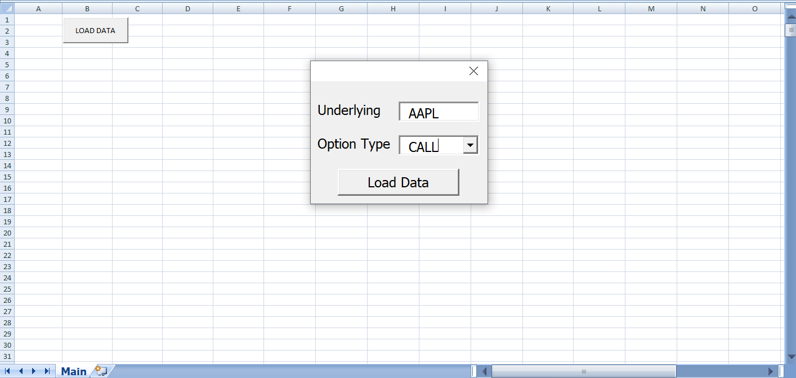
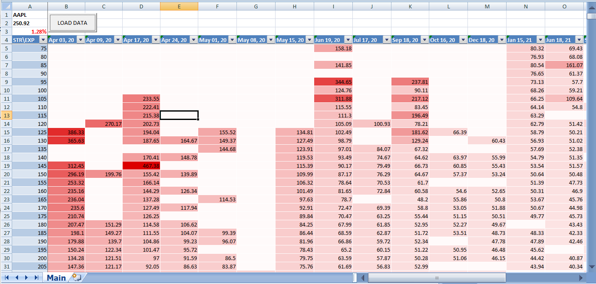

# VolSurface.xlsm
This spreadsheet enables user to create table with implied volatility values for certain stock fetched from [yahoo finance](https://finance.yahoo.com/) in 3 simple steps.

## Usage

- press `LOAD DATA` button located in the top left angle of `Main` sheet

- enter ticker of the stock and select option's type in pop-out user form and press `Load Data` button

  
  
- wait few seconds

- enjoy the result! 

  

